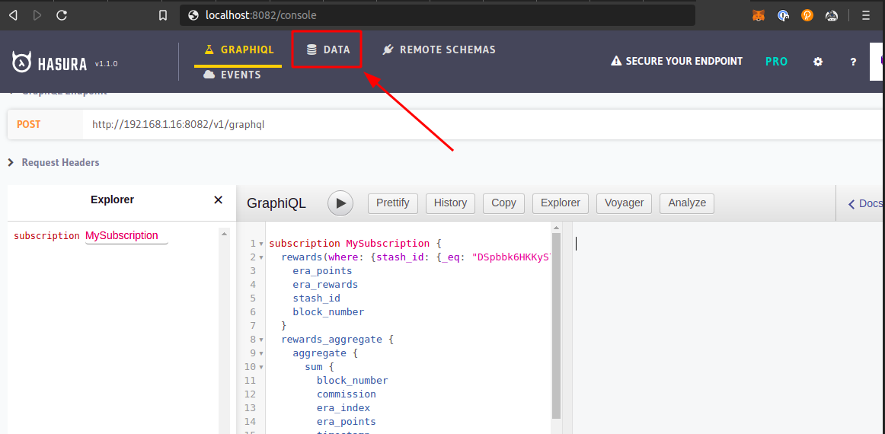
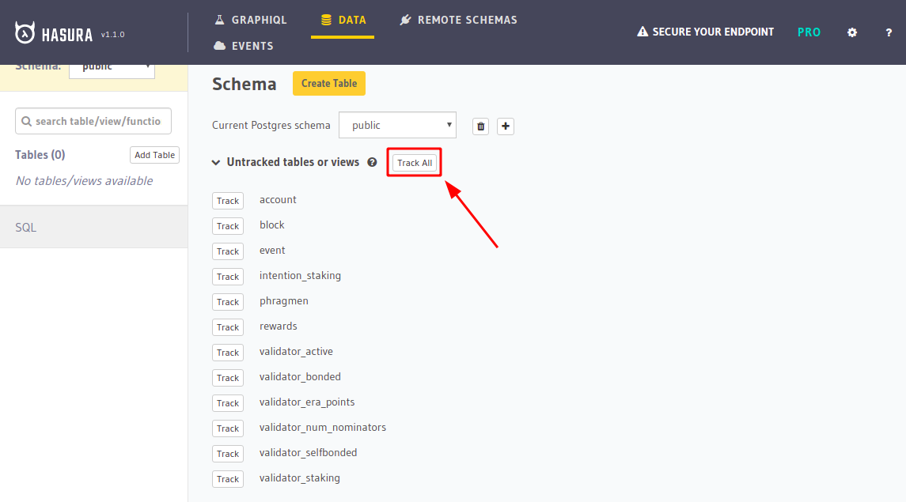

# PolkaStats Backend v3

New improved backend for https://polkastats.io!

<!--ts-->

### Table of Contents

   * [Installation Instructions](#installation-instructions)
   * [Usage Instructions](#usage-instructions)
   * [List of current containers](#list-of-current-containers)
   * [Updating containers](#updating-containers)
   * [Crawler](#crawler)
   * [Phragmen](#phragmen)


<!--te-->

## Installation Instructions

```
git clone https://github.com/Colm3na/polkastats-backend-v3.git
cd polkastats-backend-v3
npm install
```

## Usage Instructions

To launch all docker containers at once:
```
npm run docker
```
To run them separately:
```
npm run docker:<container-name>
```

## List of current containers

- substrate-node
- postgres
- graphql-engine
- crawler
- phragmen  (temporarily disabled)

## Updating containers

```
git pull
npm run docker:clean
npm run docker:build
npm run docker
```

## Crawler

This crawler container listens to new blocks and fills the database. There are a number of processes executed within this container. Some of this processes are triggered based on time configuration that can be seen in this file: [backend.config.js](https://github.com/Colm3na/polkastats-backend-v3/blob/develop/backend.config.js)
The crawler is able to detect and fill the gaps in postgres database by harvesting all the missing data, so it's safe and resilience against node outages or restarts.

## Phragmen

This container includes an offline-phragmen binary. It is a forked modification of [Kianenigma](https://github.com/kianenigma/offline-phragmen) repository.

## Hasura demo

The crawler needs to wait for your substrate-node container to get synced before starting to collect data. You can use an already synced external RPC for instant testing by changing the following lines in your
backend.config.js file

```
//const DEFAULT_WS_PROVIDER_URL = 'wss://kusama-rpc.polkadot.io';
const DEFAULT_WS_PROVIDER_URL = 'ws://substrate-node:9944'; 
```

Just uncomment out the first one and comment the second and rebuild the dockers.

```
npm run docker:clean
npm run docker
```

Then browse to http://localhost:8082

Click on "Data" at the top menu



Then add all tables to the tracking process



From now on, hasura will be collecting and tracking all the changes in the data base.

In order to check it and see its power you could start a new subscription or just perform an example query such us this one:

### Query example. Static

- Block query example:
```
query {
  block  {
    block_hash
    block_author
    block_number
    block_author_name
    current_era
    current_index
    new_accounts
    session_length
    session_per_era
    session_progress
  }
}
```

- Rewards query example:
```
query {
  rewards {
    era_index
    era_rewards
    stash_id
    timestamp
  }
}
```

- Validator by number of nominators example:
```
query {
  validator_num_nominators {
    block_number
    nominators
    timestamp
  }
}
```

- Account query example:
```
query {
  account {
    account_id
    balances
    identity
  }
}
```

### Subscription example. Dynamic

- Block subscription example:
```
subscription {
  block {
    block_number
    block_hash
    current_era
    current_index
  }
}
```

- Validator active subscription example:
```
subscription MySubscription {
	validator_active {
    account_id
    active
    block_number
    session_index
    timestamp
  }
}
```

- Account subscription example:
```
subscription MySubscription {
  account {
    account_id
    balances
  }
}
```
